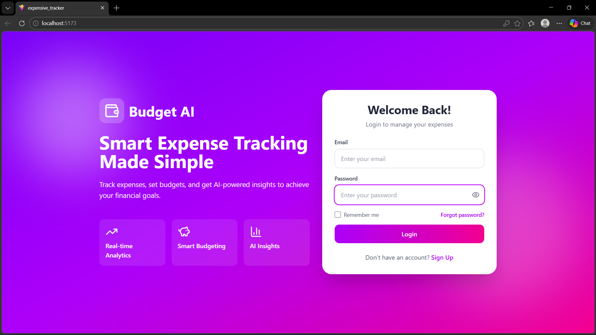
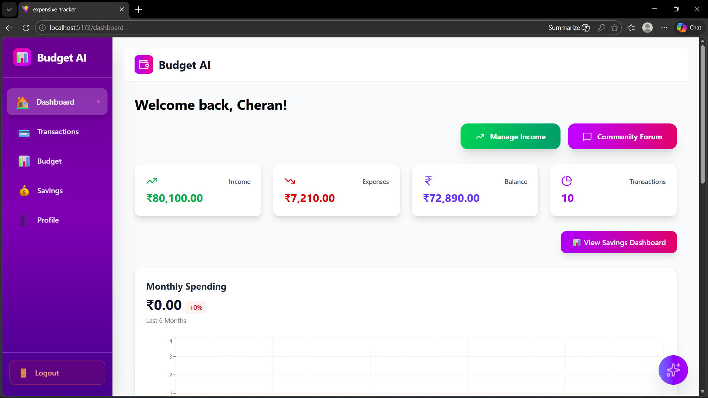
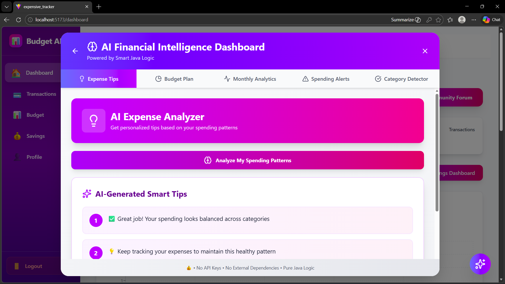

# Budget AI Tracker

Budget AI Tracker is a smart expense management application that helps users track, analyze, and manage their daily spending using intelligent insights.

## Project Overview

This project allows users to record expenses and analyze their financial habits. The system categorizes expenses and helps users improve budgeting.

## Features

* Add and manage daily expenses
* Categorize expenses automatically
* Track monthly spending
* Financial insights dashboard

## Technology Stack

Frontend:

* HTML
* CSS
* JavaScript

Backend:

* Spring Boot (Java)

Database:

* MySQL

## Project Structure

Backend/
Frontend/
pom.xml
package.json

## How to Run the Project

1. Clone the repository

git clone https://github.com/cherangovindharaj/Budget_AI-Tracker.git

2. Run Backend (Spring Boot)

3. Run Frontend using npm

npm install
npm start

4. Open in browser

http://localhost:3000

## Author

Cheran Govindharaj

## Screenshots

### Login Page

### Dashboard

### AI Expense Analyzer

